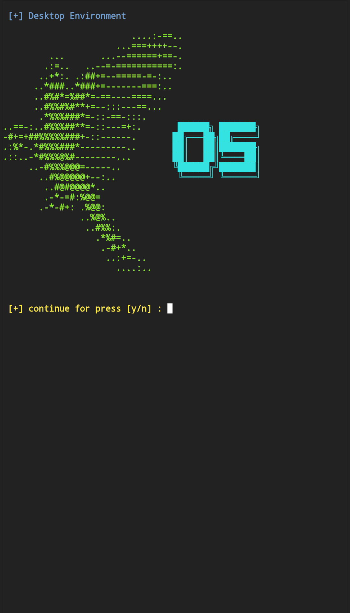

<p align="center">
  
  
  

</p>
<p align="center"><b>A beginners friendly, Automated tool</b></p>


> [!Warning]
> This tool is intended for legal security testing and educational purposes only. Unauthorized use of Parrot OS or its tools is prohibited and may be illegal. Kali Linux is a penetration testing and ethical hacking platform intended only for legal and authorized security testing. The tools and techniques provided by Kali Linux should never be used to attack or access networks, systems, or devices without explicit permission from the owner. Misuse of Kali Linux may violate laws and regulations and can lead to criminal prosecution. Users are solely responsible for their actions. The developers, maintainers, and distributors of Kali Linux are not liable for any damage or legal consequences resulting from unauthorized use.


## features 
- beginner friendly
- easy usable
- less time taken
- **automatic process**
- with letest version


## Installation 
- just update and upgrade your Termux
```powershell
apt update && apt upgrade -y
```
- should be install git pakage before installing this tool
```powershell
pkg install git -y
```
- just clone this github repository 🔥
```powershell
git clone https://github.com/Cyber-Tech0/Parrot-OS
```
- just enter in tool dictionary 
```powershell
cd Parrot-OS
```
- and give it executable permission
```powershell
chmod +x parrot-os.sh
```
- for run this tool and setup parrot os
```powershell
./parrot-os.sh
```
- On first launch, It'll install the dependencies and that's it is installed.

## Installation (one line)
> [!Tip]
> - if you want to setup **Parrot-OS** in your Android. but you don't know terminal commands then you can copy and paste this commands on your terminal and **follow given below steps.**

- one line commands past on your Termux and just press hit 🎯 enter.

```powershell
apt update && apt upgrade -y && pkg install git -y && git clone https://github.com/Cyber-Tech0/Parrot-OS && cd Parrot-OS && chmod +x parrot-os.sh && ./parrot-os.sh
```

### VNC viewers
> you will be install vnc viewer for running of **Parrot OS**. you can download vnc viewers from play Store and other sources. you can download directly vnc viewer apk link given below
##
<p align="center">
  <a href="https://play.google.com/store/apps/details?id=com.realvnc.viewer.android"> 
  </a>

### Termux Commands
> [!NOTE]
> if you don't know about Termux commands. then first of all you want to learn termux commands. if you are are interested then you can download PDF file and easily learn termux commands. [PDF download](https://drive.google.com/file/d/1kYllkvP2s27dxKE5QCRPkA3hNc5kGS1l/view?usp=drivesdk)


### open in cloud shell
<a href="https://shell.cloud.google.com/cloudshell/open?cloudshell_git_repo=https://github.com/Cyber-Tech0/Parrot-OS.git&tutorial=README.md" target="_blank"></a>

### Test on Terminal
</img>
### Follow me

<p align="center">
  <a href="https://social.tiiny.site" target="_blank">
  </a>  
  <a href="https://github.com/Cyber-Tech0" target="_blank">
  </a>
</p>
